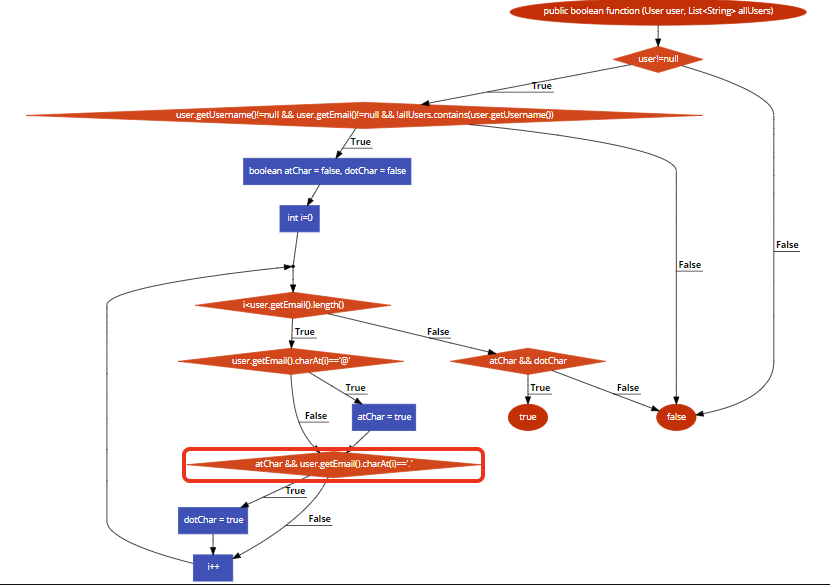

# Втора лабораториска вежба по Софтверско инженерство
# Илче Спасески, бр. на индекс 183278
# Група на код:
## Ја добив групата на код 1

# Control Flow Graph
## 

# Цикломатска комплексност
## ....

# Тест случаи според критериумот Every statement
## ....

# Тест случаи според критериумот Every path
## ....

# Објаснување на напишаните unit tests
## ... ...